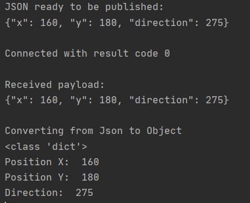

# Tuto-mqtt-py
This is a quick tutorial for mqtt in Python

##

**BEFORE TRYING TO RUN THE CODE !!!**
1) install a Python IDE (Pycharm: https://www.jetbrains.com/pycharm/)
2) make sure to have a correct interpreter or install one (https://www.python.org/downloads/)
3) install Paho mqtt client (type in the terminal: *pip install paho-mqtt*)

**Change 'blabla' inside the single/double quote by your id, pwd, topic**

 - id: with your squad id (Path Planning, Vision Control, Robot) 
 - pwd: with your squad pwd (Path Planning, Vision Control, Robot)
 - topic: with the topic you want to publish on, you can refer to the end of the first semester rules document to find it
 
**Expected output:**

